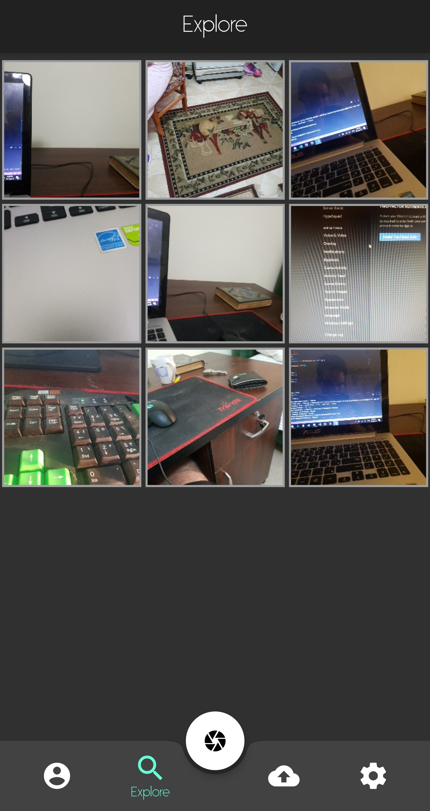

<h1 align="center">Picturie</h1>

## Key Features
 * The application will decline any upload from the mobile’s gallery. This will eliminate the selfies, filters and followers’aspects that mainly affect the user’s addiction part of the brain. 
 * Images can only be uploaded using the mobile’s camera. 
 * The application uses Business Logic Component (BLoC) pattern as a core state management architecture to handle the app’s flow of data.
 * For the backend server, Firebase authentication was used to store both users credentials and accounts information. Firebase’s Firestore was used to store all images uploaded.
 * Each user can sign in or signup using his/her google account or create a Picturie account. Alongside creating an account, the user will have a dedicated profile, number of pictures and likes count, all linked to an online backend database.
 * Users cannot view each other’s profiles, but will rather find an explore tab present in the application that will display random pictures from different users.Asettings tab to control the application’s UI
  

# Screenshots
<pre>
           

</pre>

